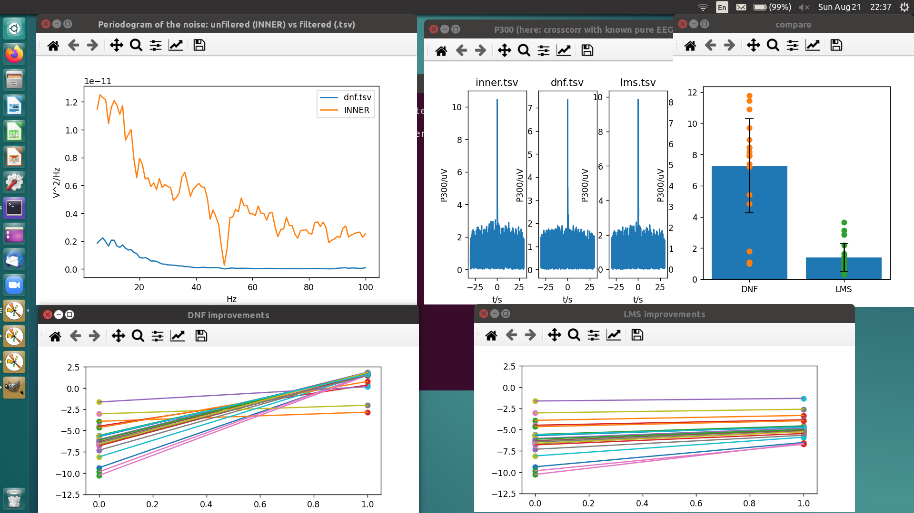

# Data analysis tools

## Pre-requisites

The following python modules are required:
 - matplotlib
 - numpy
 - plotly
 - scipy

To plot the weights please install `gnuplot`.

## Commandline parameters

All python commandline tools have the same parameters:
 - -p experiment number between 0 and 19 (default uses the `results` parent dir)
 - -s The second at which the data analysis starts (default 60sec simulated jawclench)
 - -f The filter output file used. That can be either "dnf.tsv" (default) or "lms.tsv"
 - -h Help

All parameters are optional and have default values set.

## explore.py

Displays a timedomain and frequency domain plot either in
matplotlib or in the browser.
```
./explore.py -p experiment -s startsec -e endsec -f noiseredfile.tsv -t task -m -h
```
 - Option -m switches over to matplotlib. Default is plotly.
 - Option -e is the second where the plot ends in the timedomain.

## p300.py
Plots the amlitude of the pure EEG signal. Note that this is still called P300
for compatibility to the real EEG recordings but here the pure EEG of course
known and is simply cross-correlated with the signals to determine the pure
EEG component.
```
./p300.py -p experiment -s startsec -f file -h
```

## snr.py



Calculates the SNR of one experiment
```
./p300.py -p experiment -s startsec -f file -h
```

## SNRcompareDNFLMS.py
Compares DNF SNR increase against LMS SNR increase for simulated jawclench.
```
./SNRcompareDNFLMS.py
```

## plot_weights_subject10_jawclench.plt
Gnuplot script which plots the weights of the individual layers for the non-stats version.
```
gnuplot plot_weights.plt
```
which generates `plot_weights.eps`.
